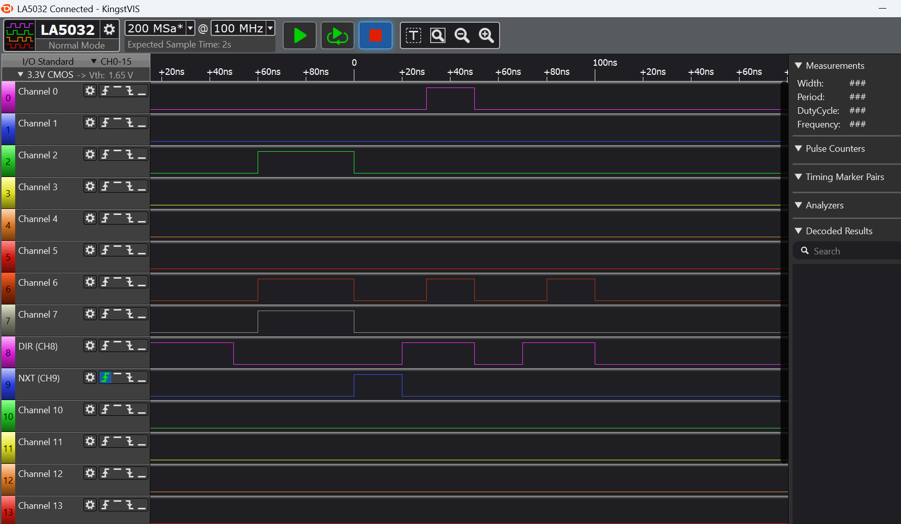
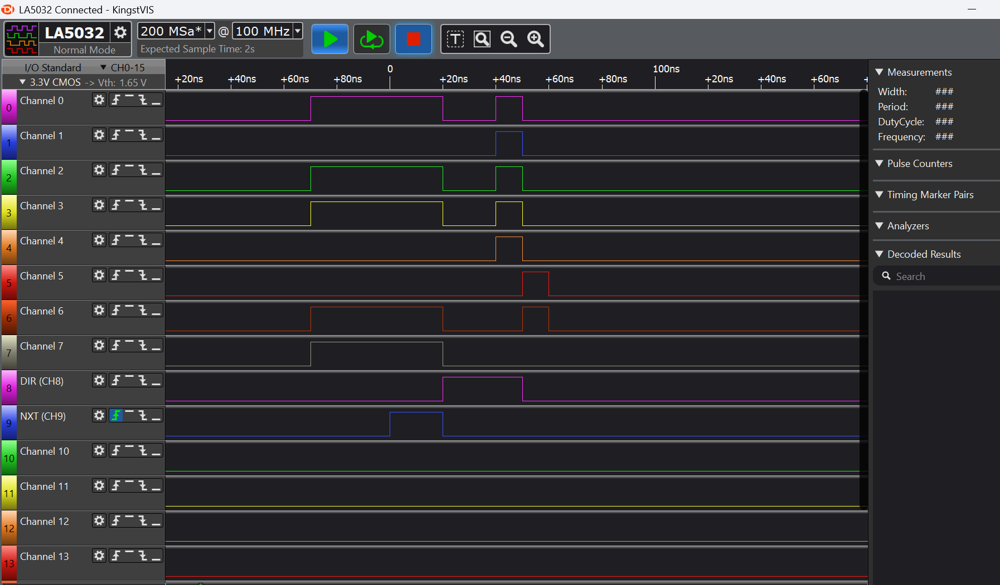

# Table of contents
1. [EP4EC6](#EP4EC6)
	1. [Install Quartus II](#Install_Quartus_II)
    2. [LED Example](#LED_Example)
	3. [Flashing the bitstream](#Flashin_The_Bitstream)
2. [Creating a new Project](#paragraph2)


# EP4EC6 <a name="EP4EC6"></a>

## Install Quartus II <a name="Install_Quartus_II"></a>

## LED Example <a name="LED_Example"></a>

## Flashing the bitstream <a name="Creating_a_new_Project"></a>

First you have to install a driver for the USB Blaster.
Once Quartus II is installed, the driver is available in the folder C:\altera\13.1\quartus\drivers\usb-blaster
Windows 11 will not accept this driver unless you disable memory integrity in the core isolation menu:
Into the start menu, type "core isolation", open the menu. Turn off "Memory Integrity" and restart your PC.
After restarting your PC, the USB Blaster should show up in the Device Manager and there should be no warnings
in the drivers settings of that device. You want to see the text: "This device is working properly."

Connect the USB-Blaster to the FPGA-Board.
Open the programmer using the button in the toolbar or the very last entry in the list of compilation steps.
Then, inside the programmer dialog, first click on "Hardware Setup..."
The Hardware Setup Dialog has to list the USB blaster automatically. Double click it, so it is selected in the
top input field and click on "Close"

Add Device: Cyclone IV E > EP4CE6E22
The programmer will detect the EP4CE6E22 automatically.

It will also preselect the LED_4.sof file.

Once the USB Blaster Hardware is detected and also the .sof file is selected, the Start button should light up.

The design is not burned onto the FPGA and not written into any flash. It is just copied into some volatile
memory. This means after a powercycle, the factory example is back.

A simple change is to make the LEDS blink faster by changing the LED_4 file and the line 

```
else if (counter == 1250000) begin
```

to 

```
else if (counter == 2500000) begin
```

or 

```
else if (counter == 625000) begin
```

Then recompile the project and use the programmer dialog to upload the .sof bitstream to the FPGA.
The LED pattern should execute a lot faster now using 625000 and slower using 2500000.

TODO: explain where to retrieve the official examples.
They are currently stored here: C:\Users\lapto\Downloads\EP4CE6-Verilog-VHDL


# Creating a new Project <a name="Creating_a_new_Project"></a>

Family: Cyclone IV E 
PinCount: 144

Name: EP4CE6E22C8, CoreVoltage: 1.2V, LEs: 6272, User I/Os: 92, Memory Bits: 276480, 

Enter the word "EP4CE6E22C8" into the "Name Filter" input field!

Once the project is created, you need to add at least one verilog file and make
that verilog file the top level entity by switching to the Files tabe, opening
the context menu on the verilog file and selecting "Set as Top-Level Entity".

Next you need to specify in/out pin assignments so that the correct pins are
accessed by your source code. Run "Analysis & Synthesis" then from the "Assignments" 
menu, selects "Pin Planner".

For the waveshare CoreEP4CE6 and the base board, some usfull pinouts are:

```
clk,    Input, PIN_23, 	I/O Bank = 1, 3.3V LVTTL (default), 8mA
led[3], Bidir, PIN_3,	I/O Bank = 1, 3.3V LVTTL (default), 8mA
led[2], Bidir, PIN_7,	I/O Bank = 1, 3.3V LVTTL (default), 8mA
led[1], Bidir, PIN_10,	I/O Bank = 1, 3.3V LVTTL (default), 8mA
led[0], Bidir, PIN_11,	I/O Bank = 1, 3.3V LVTTL (default), 8mA
nrst,   Input, PIN_125, I/O Bank = 7, 3.3V LVTTL (default), 8mA
```

Full list: https://www.waveshare.com/w/upload/0/01/EP4CE6-pin-conf.txt


# Motherboard: http://waveshare.com/dvk601.htm

http://waveshare.com/dvk601.htm
https://www.waveshare.com/wiki/DVK601


# USB3300

HINT: The USB3300 extension board from waveshare has two 5V pins! I am not sure if
these pins are 5V inputs or if they output 5V should you connect the extension board
to a laptop using a USB cable for example!
Connecting 5V to a FPGA is the FPGA's sure death or irreparable damage is caused which renders
your FPGA useless. Therefore I suggest to not connect these 5V pins to the FPGA at all
unless you know exactly what you are doing! (I have just bent the pins to the side so that they
do not plug into the female header of the motherboard!).

According to this discussion: https://electronics.stackexchange.com/questions/177871/waveshare-usb3300-board-with-stm32f429
the 5V pins are there to power the USB port which means that it will provide 5V to the device connected to the USB port.
The voltage on the USB port is called VBUS in USB-speak. After talking to an FPGA expert, there is a chance, that the
5V pins are used to supply VBUS from an external power supply and that the 5V are routed through the USB3300 but not
to the FPGA. This might also means that the USB3300 sinks the voltage into the ground plane without the FPGA getting
into contact with the 5V. I am not sure if this theory is correct or not.

I asked a question on stack overflow: https://electronics.stackexchange.com/questions/753447/can-the-waveshare-usb3300-5v-pins-damage-an-fpga
A nice user answered. The USB3300 extension board contains extended power switches for VBUS. When running the
USB3300 over the USB-A connector it acts as a perihperhal. The switches are then blocking the 5V going out the ULPI side
and therefore the FPGA should not get in contact with 5V. I have bent the 5V pins and not connected them to the FPGA for
extended safety. I have not tested the OTG scenario but the perihperal scenario does not damage the FPGA with bend / not connected
5V pins while being powered by a Microsoft Windows Laptop!


For the following, we first need to understand how the I/O ports are labeled!

HINT: I never understood how the labels given in the schematics can be translated to pin names in the Quartus II
Pin Planner! The only thing that really worked was to put male dupont wires into the female headers and use
an oscilloscope to measure the pins toggle. I used a verilog test application to toggle each female connector
on the header one by one and noted down, which pins have which Pin on the FPGA EP4CE6. A very good tip is to 
turn the USB3300 ULPI board around and look at the silk screen of the PCB. The silk screen has the pin function
printed next to each pin. Here is the mapping I uncovered for the 16I/Os_1 header.

```
PIN49 - Data4
PIN50 - clkout
PIN51 - Data5
PIN52 - DIR
```

Locking at the schematic of the Motherboard DVK601 (https://www.waveshare.com/w/upload/3/3c/DVK601-Schematic.pdf),
we can see that the two 16I/Os_1 and 16I/Os_2 do have 20 pins in total of which only 16 carry signals that
the FPGA can consume or produce. The four other pins are GND and Voltage pins. The four GND and Voltage pins
have no name on the trace. This means that these four pins are not mappable in the pin assignment. Only
the 16 signal pins to have names on the traces!

Here is the list of names and the respective pin numbers on the pin socket 16I/Os_1:

```
 6 - I/O1_1
 8 - I/O1_2
10 - I/O1_3
12 - I/O1_4
14 - I/O1_5
16 - I/O1_6
18 - I/O1_7
20 - I/O1_8

 5 - I/O2_1
 7 - I/O2_2
 9 - I/O2_3
11 - I/O2_4
13 - I/O2_5
15 - I/O2_6
17 - I/O2_7
19 - I/O2_8
```

Here is the list of names and the respective pin numbers on the pin socket 16I/Os_2:

```
 6 - I/O1_13
 8 - I/O1_14
10 - I/O1_15
12 - I/O1_16
14 - I/O1_17
16 - I/O1_18
18 - I/O1_19
20 - I/O1_20

 5 - I/O2_13
 7 - I/O2_14
 9 - I/O2_15
11 - I/O2_16
13 - I/O2_17
15 - I/O2_18
17 - I/O2_19
19 - I/O2_20
```

Clockout - pin 12 (PA5) on the breakout - on the Motherboard DVK601: Bank: 16I/0s_1, pin 11 (I/O2_4)

The pin assignment below tells you what PIN you need to activate:
As an example: the clockout of the extension/breakout board is connected to the motherboard pin 11 of the 16I/0s_1.
This can be deduced from https://www.waveshare.com/wiki/USB3300_USB_HS_Board and from https://www.waveshare.com/w/upload/3/3c/DVK601-Schematic.pdf
Now, in the list below, look for a name that matches 16I/0s_1 and pin 11.
I guess it is 16I/Os_1_11 which is mapped to PIN_43.

```
#16I/Os_1
set_location_assignment	PIN_58	-to	16I/Os_1_1	   
set_location_assignment	PIN_55	-to	16I/Os_1_2
set_location_assignment	PIN_54	-to	16I/Os_1_3
set_location_assignment	PIN_53	-to	16I/Os_1_4
set_location_assignment	PIN_52	-to	16I/Os_1_5
set_location_assignment	PIN_51	-to	16I/Os_1_6
set_location_assignment	PIN_50	-to	16I/Os_1_7  ----------> In the schematic, this is pin 16I/Os_1 12 (I/O1_4) (lower row, pin 5 from the left, when looking into the header)
set_location_assignment	PIN_49	-to	16I/Os_1_8  ----------> In the schematic, this is pin 16I/Os_1 11 (I/O2_4) (upper row, pin 5 from the left, when looking into the header)

set_location_assignment	PIN_46	-to	16I/Os_1_9
set_location_assignment	PIN_44	-to	16I/Os_1_10
set_location_assignment	PIN_43	-to	16I/Os_1_11
set_location_assignment	PIN_42	-to	16I/Os_1_12
set_location_assignment	PIN_39	-to	16I/Os_1_13
set_location_assignment	PIN_38	-to	16I/Os_1_14
set_location_assignment	PIN_34	-to	16I/Os_1_15
set_location_assignment	PIN_33	-to	16I/Os_1_16
```

#16I/Os_2

```
set_location_assignment	PIN_2	-to	16I/Os_2_1	   
set_location_assignment	PIN_1	-to	16I/Os_2_2
set_location_assignment	PIN_144	-to	16I/Os_2_3
set_location_assignment	PIN_143	-to	16I/Os_2_4
set_location_assignment	PIN_142	-to	16I/Os_2_5
set_location_assignment	PIN_141	-to	16I/Os_2_6
set_location_assignment	PIN_138	-to	16I/Os_2_7
set_location_assignment	PIN_137	-to	16I/Os_2_8
set_location_assignment	PIN_136	-to	16I/Os_2_9
set_location_assignment	PIN_135	-to	16I/Os_2_10
set_location_assignment	PIN_133	-to	16I/Os_2_11
set_location_assignment	PIN_132	-to	16I/Os_2_12
set_location_assignment	PIN_129	-to	16I/Os_2_13
set_location_assignment	PIN_128	-to	16I/Os_2_14
set_location_assignment	PIN_127	-to	16I/Os_2_15
set_location_assignment	PIN_126	-to	16I/Os_2_16
```

# Test #0 - UART

If found that the UART works with samples found on the internet only if a clock lower than 50 Mhz is used!
Most samples from the internet allow to compute a CLOCKS_PER_BIT value. This value is computed from the
clock frequency and the target baud rate. For the 50 Mhz clock and a target baudrate of 115200 baud, this
value is 50000000 / 115200 = 434. When using this value with the UART designs from the internet, the UART
does not work!

The solution I found was to use a ClockDivider design which has the 50Mhz hardware clock as input and
produces a 10Mhz output "software" clock as output. This 10Mhz clock using a baudrate of 115200 and
a CLOCKS_PER_BIT vaue of 10000000 / 115200 = 87 makes the UART work!

The sample code is available inside the UART subfolder.


# Test #1 - 60 Mhz Clock

The first test is to check if the 60Mhz clock is in fact produced by the extension board on pin clkout.
Therefore, copy the LED example and instead of using the FPGAs clk signal, use PIN50 in your top-level
design. Then make a counter variable that is incremented each posedge of the USB clk. The counter
will count from 0 to 60000000 each second with the 60Mhz USB clock. When the counter has reached 
60000000 one second is over. Each time when the timer reaches 60000000, toggle the LEDS. When the design
is run on the FPGA, you will turn the LEDS toggle every second!

Here is the top-level design:

```
module LED_4(
	input nrst,
	input clk,
	inout reg [3:0]led,
	input wire pin16IOs_1_8
	);
	
	reg [31:0] counter;	
	reg clk2;
	reg [7:0] i;	
	reg [3:0] led_reg;
	
	always @(posedge pin16IOs_1_8)
	begin
	
		if(!nrst) 
		begin
			counter <= 32'd0;
			led <= 4'd0;
		end
		
		if (counter == 60000000)
		begin
			counter <= 0;
			led <= ~led;
		end
		else
		begin			
			counter <= counter + 32'd1;
		end
		
	end
	
endmodule
```


# Test #2 - Reseting the PHY using the RST pin

In order to perform any register interaction, the link must wait for DIR to be deasserted by the PHY.
For me, DIR never deasserted until I tested the RST pin. Asserting RST (HIGH) will cause the PHY 
to reset. Deasserting RST (LOW) causes the PHY to begin operation. After going through a one second
reset phase, clkout kept running and also DIR was deasserted. Now the PHY is ready to receive register
commands.

Here is the code:

```
module LED_4(

	// clock and reset
	input nrst,
	input clk,
	
	// LEDs
	inout reg [3:0]led,
	
	// ULPI
	input wire clkout,
	input wire DIR, // PIN 52
	
	output wire RST // PIN 46
	);
	
	reg [31:0] counter;	
	reg [31:0] counter2;
	reg clk2;
	reg [7:0] i;	
	reg [3:0] led_reg;
	
	// when reset is asserted, the phy resets
	reg [31:0] reset_counter;
	reg reset_performed;
	reg RST_reg;
	assign RST = RST_reg;
	
	always @(posedge clkout)
	begin
		if(!nrst) 
		begin
			led[1] <= 1; // LED 3 (L3) (1 = off, 0 == on)
		end
		else
		begin		
			led[1] <= DIR; // LED 3 (L3) (1 = off, 0 == on). When the LED is off, DIR is 1 (HIGH)
		end
	end
	
	always @(posedge clkout)
	//always @(posedge clk)
	begin
	
		if(!nrst) 
		begin
			counter <= 32'd0;
			led[0] <= 1; // L4 (1 = off, 0 == on)
			//led[1] <= 1; // L3 (1 = off, 0 == on)
			led[2] <= 1; // L2 (1 = off, 0 == on)
			led[3] <= 1; // L1 (1 = off, 0 == on)
			
			reset_performed <= 0; // no reset performed yet
			RST_reg <= 1; // assert the reset pin to trigger a reset
		end
		
		if (counter == 60000000)
		begin
			counter <= 0;
			//led <= ~led;
			led[0] <= ~led[0];
			
			// YORO - you only reset once
			if (reset_performed == 0)
			begin
				reset_performed <= 1;
				RST_reg <= 0;
			end
			
		end
		else
		begin			
			counter <= counter + 32'd1;
		end		
		
	end
	
	/* PIN Tester command
	always @(posedge clk)
	begin
	
		if(!nrst) 
		begin
			counter2 <= 32'd0;
		end
			
		if (counter2 == 30000000)
		begin
			counter2 <= 0;
			RST_reg <= ~RST_reg;
		end
		else
		begin			
			counter2 <= counter2 + 32'd1;
		end
		
	end
	*/
	
endmodule
```


# Test #3 - Hard and Soft Reset

## Hard Reset via the Reset Pin

The datasheet (https://www.waveshare.com/wiki/File:USB3300-USB-HS-Board-Datasheets.pdf) says the following about the Reset pin.

```
6.1.11
Reset Pin
The reset input of the USB3300 may be asynchronously asserted and de-asserted so long as it is held
in the asserted state continuously for a duration greater than one clkout clock cycle. The reset input
may be asserted when the USB3300 clkout signal is not active (i.e. in the suspend state caused by
asserting the SuspendM bit) but reset must only be de-asserted when the USB3300 clkout signal is
active and the reset has been held asserted for a duration greater than one clkout clock cycle. No
other PHY digital input signals may change state for two clkout clock cycles after the de-assertion of
the reset signal.
```

Question: does the RST pin count as a power-cycle, in other words, does it make the PHY reset the 
registers to their default states or not?

And also

```
6.4.2
Power On Reset (POR)
The USB3300 provides an internal POR circuit that generates a reset pulse once the PHY supplies
are stable. This reset will set all of the ULPI registers to their default values and start the PHY in normal
operation. Cycling the 3.3 volt power supply is the only method for the PHY to reset the ULPI registers
to their default states. The Link can write the registers to their default states at any time in normal
operation.
The RESET pin has the same functionality as the RESET register in the Function Control Register.
```

And also

```
The RESET bit in the Function Control Register does not reset the bits of the ULPI register array.
```

## Softreset via Registers

3.5 Power On and Reset

First perform a hard reset using the 

From the Link (FPGA) perspective:
1. Wait for the 60Hz clock to appear
2. Set the Reset pin in the Function Control register.
3. Wait for DIR to assert and then wait for it to de-assert which is when the PHY has reset
4. Now the PHY will assert DIR again and then it will send a RX CMD. Be ready to receive RX CMD.

## Setting a bit in the Function Control register
Perform a 04h (WRITE) with the bit 5 HIGH

1. [Register Write 10b][Address==0x05] == [10][000101] == 0x85  ---> The link writes this byte to the data pins
2. Send bit 5 for RESET 00100000 = 0x20

See 6.1.5.1 ULPI Register Write (doc/00001783C.pdf)

To write to a register, the Link will wait until DIR is low, and at T0, drive the TXD CMD on the databus.
At T2 the PHY will drive NXT high. 
On the next rising clock edge, T3, the Link will write the register data. 
At T4 the PHY will accept the register data and the Link will drive an Idle on the bus and drive STP high to signal the end of the data packet. 
Finally, at T5, the PHY will latch the data into the register and drive NXT low. The Link will pull STP low.


# Test #4 - Interacting with Registers

The ULPI 1.1 specification dictates that a ULPI device has to have a set of 8 bit registers.

To interact with registers, there are four operations defined

- READ
- WRITE
- SET
- CLEAR

According to the table 6.3 ULPI Register Map (page 23) not all registers support all operations.
For example Vendor ID only supports READ.

Each operation for each register has a unique address assigned. For example 
Vendor ID Low, READ has the address 0x00.

## READ

6.1.5.2 ULPI Register Read (doc/00001783C.pdf)

To perform Vendor ID Low, READ go through the following steps

Prerequisits: clkout produces the 60 Mhz clock. All interaction is clocked on the posedge of said
60Mhz clock!

```
A command from the Link begins a ULPI transfer from the Link to the USB3300. Anytime the Link
wants to write or read a ULPI register, the Link will need to wait until DIR is low, and then send a
Transmit Command Byte (TXD CMD) to the PHY. The TXD CMD byte informs the PHY of the type of
data being sent. The TXD CMD is followed by the a data transfer to or from the PHY. Table 6.4, "ULPI
TXD CMD Byte Encoding" gives the TXD command byte (TXD CMD) encoding for the USB3300. The
upper two bits of the TX CMD instruct the PHY as to what type of packet the Link is transmitting.
```

1. Link waits until DIR is low.
2. Link send a Transmit Command Byte (TXD CMD) to the PHY.
3. The TXD CMD is followed by the a data transfer to or from the PHY. For a READ, the PHY will send data.

The TXD CMD describes several operations. The operation is selected using the upper-most two bits called CMD BITS.

A READ is described by 11xxxxxx in binary. The xxxxxx contains the address. 
To read Vendor ID Low, the address is 0x00. So combining the CMD BITS with the address 0x00 yields 11000000b = 0xC0.

Figure 6-5, page 26, (doc/00001783C.pdf)

* At T0, the Link will place the TXD CMD on the databus. 
* At T2, the PHY will bring NXT high, signaling to the Link that it is ready to accept the data transfer. (It will NOT latch the data yet!). 
* At T3, the PHY reads the TXD CMD, determines it is a register read, and asserts DIR to gain control of the bus. The PHY will also de-assert NXT. 
* At T4, the bus ownership has transferred back to the PHY and the PHY drives the requested register onto the databus. 
* At T5, the Link will read the databus and the PHY will drop DIR low returning control of the bus back to the Link. 
* At T6, After the turn around cycle, the Link must drive a ULPI Idle command at T6.

## Reading Vendor ID and Product ID

A good test would be to read the Vendor ID and the Product ID because the datasheet specifies
well-defined, fixed values for these registers.

The detailed signal diagram is given on page 26 in https://ww1.microchip.com/downloads/en/DeviceDoc/00001783C.pdf

IMPORTANT HINT: It seems that this fact is not very well documented in the datasheet but it is documented in the
signal diagrams. The fact is: the STP signal is a signal that the link outputs and the PHY reads! The Link has to 
set STP to a low signal in order for the PHY to even react to register reads! When STP is not pulled low, the NXT 
signal will never go high and the register read will not be exected! As a general tip, when a signal diagram in the
datasheet shows a signal and that signal is output by the Link, make sure to set it to the exact value shown in the
diagram! For the data lines which are inout and therefore both read and written by both the PHY and the LINK, 
I am not sure yet how to deal with those lines.

0. The Link pulls STP low.
0. The Link drives a ULPI idle command. Which is defined on page 24 by [00][000000]
1. Link waits until DIR is low. 
2. Link places the command byte on to the eight data pins. (This means write the bytes to the data pins)
3. When NXT is driven high by the PHY this means that the PHY has latched the command and starts processing.
4. The PHY will now deassert NXT and assert DIR
5. When the PHY sees an asserted DIR it will stop driving the command on the data pins because the PHI has taken control over the bus. 
read incoming data from the data pins
6. At the next rising edge of clkout, the Link reads the data pins to receive the result.
7. When DIR goes low, the LINK will drive the ULPI idle command on the pin.

Using a logic analyzer (which has to be plenty fast for the 60 Mhz USB clock!) the signals can be captured.
Here is the captured register read of the Vendor Id (LOW)


According to the datasheet the Vendor Id (LOW) is 0x24.

Here is the captured register read of the Vendor Id (HIGH)


According to the datasheet the Vendor Id (HIGH) is 0x04.

Looking at the timestamp +40 ns, the PHY will place the loaded register value on the data lines.
The value 0x24 for Vendor Id (LOW) has the bit pattern 00100100. Looking at Channel 0 to Channel 7,
we can see that exact bit pattern. The same goes for the value 0x04 for Vendor Id (HIGH)
on Channel 0 to Channel 7 at timestamp +40 ns. Here, we can see the bit pattern 00000100 which is
the value 0x04.

## Reading the FunctionControl Register (0x04)

6.1.4.5 page 21 of 00001783C.pdf

Reading the FunctionControl Register using the command 0xC4 yields the default value of 0x41 as 
stated in the datasheet of the USB3300.



0x41 translates to (see page 24 of doc/0900766b811a5521.pdf):

0x41 == 0100 0001 

From LSB (right) to HSB (left):

* 01 - Enables FS transceiver (FS = FullSpeed)
* 0 - ??? controls termination through pull-up and pull-down resistors
* 00 - OperationMode is set to normal operation
* 0 - Reset is cleared. Meaning the transceiver has moved out of reset (active high signal, high during reset)
* 1 - Not in Suspended State. Active Low Signal, means currently disabled. This value shows if the Phy is in suspended state (true == LOW)
* 0 - Reserved and drive low (no information)


## Reading USB Interrupt Enable Rising (0x0D)

Reading the Interrupt Enable for Rising signals register. See section 6.1.4.8 on page 26 in doc/0900766b811a5521.pdf.



Default Value: 11111000

From LSB (right) to HSB (left):

* HostDisconnect Rise - Generate an interrupt event notification when Hostdisconnect changes from low to high. !!! Applicable only in host mode. !!!
* VbusValid Rise - Generate an interrupt event notification when Vbusvalid changes from low to high.
* SessValid Rise
* SessEnd Rise
* IdGnd Rise
* Reserved
* Reserved
* Reserved

## USB Interrupt Status Register (0x13)

See 6.1.4.10 on page 27 in doc/0900766b811a5521.pdf.

11000000 + 00010011 = 11010011 = 0xD3


11 00 10 11


## Setup Packet

https://www.beyondlogic.org/usbnutshell/usb6.shtml

8'h2d - 00101101
[0][01][01101]

[0] - Host to Device
[01] - Class
[01101] - 


## Plugin in USB cable into the peripheral USB port

A packet 0x48 arrives when the USB cable is either plugged in or out a windows PC.

0x48

This packet is sent from the PHY to the Link when the cable is plugged in or out.

According to table 6.4 on page 28, this might be a "Transmit" command.
But I think this is a table for commands that the Link sends to the PHY.

Decoding according to Table 6.6 on page 31:

0x48 == 01 00 10 00

0  - Reserved
1  - State of ID pin
00 - RX Event Encoding
10 - encoded VBUS state
00 - Linestate


https://cross-hair.co.uk/tech-articles/ULPI%20interface.html

" 
When the DIR signal is asserted and the NXT signal stays low a RXCMD byte is received that generally represents the PHY status.
This is useful to determine the state of the D- and D+ lines to determine if the peripheral has been connected to a host.
"

Table 6.5 ULPI RX CMD Encoding, page 31.

00 01 00 10

00 - Linestate
01 - ENCODED VBUS VOLTAGE STATES
00 - ENCODED UTMI EVENT SIGNALS
1  - State of ID pin
0  - Reserved


10 00 10 10 

10 - Linestate (10 == 10 K (LS idle))
00 - ENCODED VBUS VOLTAGE STATES
10 - ENCODED UTMI EVENT SIGNALS
0  - State of ID pin
1  - Reserved

10 00 10 10 


0x8a 10 00 10 10 


New project:

Cyclone  


# Initializing the USB3300 chip to FS speed Correctly

After https://cross-hair.co.uk/tech-articles/ULPI%20interface.html the USB3300 needs to be reset and after that, 
the OTG mode has to be disabled in order to make the USB3300 operate as a peripheral. After OTG is disabled,
it is necessary to place the USB3300 into FullSpeed (FS) mode because this is the mode in which a USB device needs
to connect to an operating system. (Once connected the USB peripheral and the OS can negotiate another speed potentially
higher than Fullspeed, but FullSpeed (FS) is the initial speed expected!).

Now, the USB3300 is ready to be connected to Microsoft Windows for example!
Windows will send packets to the USB3300 peripheral and try to enumerate it and request descriptors to identify which
USB profile the peripheral supports in order to load the respective driver.

As the Verilog Code does not react to any of the USB Packets yet, there will be a Microsoft Windows USB connection sound
followed by a disconnection sound and an error message that windows detected a malfunctioning USB device. Microsoft
Windows announces that the device connected last did malfunction and could not be connected properly!

Next let's look at the packets that are exchanged in this (broken) state of the Verilog USB3300 application:

Using LA5032 Logic Analyzer by Kingst, which supports D+ D- USB FS decoding, the following screenshots were taken:


On the far right, there is a list of all decoded packets send from Microsoft Windows to the USB3300 peripheral.

* Reset - Sequence - I do not know what that is exactly !!!

See: https://cross-hair.co.uk/tech-articles/ULPI%20interface.html
The USB 2.0 reference document states in section 9.1.1.3 states “After the device has been powered, 
it must not respond to any bus transactions until it has received a reset from the bus. After receiving a reset,
the device is then addressable at the default address.” (Question: What is the default address?)

After the reset, the host starts to send Start of Frame (SOF) packets every millisecond (since the peripheral says
that it is a FullSpeed (FS) device)


* SYNC
* PID SOF
* Frame # 075
* CRC OK 0x1C
* EOP

Then follow a bunch of similar packets. Until packet # 0x096

* SYNC
* PID SOF
* Frame # 096
* CRC OK 0x18
* EOP

Then there will be a SETUP packet:


* SYNC (10000000bin (in the Logic Analyzer, the LSB arrives first so in the logic analyzer the SYNC looks like 00000001)
* PID SETUP (Binary: 2D == 00101101, 00 = 00000000 10 = 00010000 
* Address=0x00 Endpoint=0x00
* CRC OK 0x02
* EOP

Followed by a GetDescriptor (Device) packet.


* SYNC
* PID DATA0 (== 0xC3 == 11000011 which is the 1100 PID and the mirrored version 0011. This Packet ID (PID) type is: 0011 = DATA.DATA0 see https://www.beyondlogic.org/usbnutshell/usb3.shtml)
* BYTE 0x80
* BYTE 0x06
* BYTE 0x00
* BYTE 0x01
* BYTE 0x00
* BYTE 0x00
* BYTE 0x40
* BYTE 0x00
* CRC OK 0x94DD
* EOP

According to https://www.kampis-elektroecke.de/mikrocontroller/avr8/at90usb1287-usb/usb-protocoll/
This is the beginning of the Windows GET_DESCRIPTOR request.

According to https://cross-hair.co.uk/tech-articles/ULPI%20interface.html, the byte sequence 
80 06 00 01 00 00 40 00 is the GetDescriptor(Device) command send by the host to the device.

The device has to ACK. Currently our device does not ACK so the host will send two more of those
SETUP, GetDescriptor(Device) commands and then gives up.

TODO: implement the functionality to place a ACK packet on the bus
and implement the feature to write an entire Descriptor (Device) onto the bus.

All these packets seem to be Start of Frame (SOF) packest. SOF packets are sent every millisecond for full speed.
They contain a eleven bit frame number as payload. 

According to https://www.keil.com/pack/doc/mw/usb/html/_u_s_b__protocol.html, the SOF packet starts the timeframe
in which the device is allowed to send/receive ??? data on each pipe. There is a time segment reserved for each
pipe and the respective pipe is allowed to transmit/receive only in it's respective timeslot.

In our example since there are no pipes, there is no piped data!

The SOF packet consists of a 

* x bit SYNC sequence
* 8 bit PID (the 8 bit are a 4 bit PID and it's reverse version. 2 times 4 yields 8 bit) The PID for the SOP is 1010 and in reverse 0101
* 11 bit Frame Number
* 5 bit CRC5 checksum
* x bit EOP End of Packet (maybe 3 bit)

Lets look at the first message:

The first part is the SYNC


# USB Cable

https://www.beyondlogic.org/usbnutshell/usb2.shtml

Pin Number		Cable Colour	Function
1				Red				VBUS (5 volts)
2				White			D-
3				Green			D+
4				Black			Ground


# USB Speeds

https://en.wikipedia.org/wiki/USB_communications

The host controller divides bus time into 1 ms frames when using low speed (1.5 Mbit/s) and full speed (12 Mbit/s), 
or 125 μs microframes when using high speed (480 Mbit/s), during which several transactions may take place.


https://www.keil.com/pack/doc/mw/usb/html/_u_s_b__protocol.html

The Start-of-Frame packet is sent every 1ms on full speed links.


https://www.beyondlogic.org/usbnutshell/usb3.shtml
https://www-user.tu-chemnitz.de/~heha/hsn/chm/usb.chm/usb3.htm

Start of Frame Packets
The SOF packet consisting of an 11-bit frame number is sent by the host every 1ms ± 500ns on a full speed bus or every 125 µs ± 0.0625 µs on a high speed bus.

|       |              |                    |          |   |
|-------|--------------|--------------------|----------|---|
|Sync	|PID	       |Frame Number	    |CRC5	   |EOP|

Sync - All packets must start with a sync field. The sync field is 8 bits long at low and full speed 
or 32 bits long for high speed and is used to synchronise the clock of the receiver with that of the transmitter. 
The last two bits indicate where the PID fields starts.

PID - PID stands for Packet ID. This field is used to identify the type of packet that is being sent. 
The following table shows the possible values.


| Group		| PID Value		| Packet Identifier      |
| --------- | ------------- | ---------------------- |
|Token		| 0001			| OUT Token              |
|			| 1001			| IN Token               |
|			| 0101			| SOF Token              |
|			| 1101			| SETUP Token            |
|			|               |                        |
|Data		| 0011			| DATA0                  |
|			| 1011			| DATA1                  |
|			| 0111			| DATA2                  |
|			| 1111			| MDATA                  |
|			|               |                        |
|Handshake	| 0010			| ACK Handshake          |
|			| 1010			| NAK Handshake          |
|			| 1110			| STALL Handshake        |
|			| 0110			| NYET (No Response Yet) |
|			|               |                        |
|Special	| 1100			| PREamble               |
|			| 1100			| ERR                    |
|			| 1000			| Split                  |
|			| 0100			| Ping                   |


Frame Number -

CRC5 -

EOP - End of packet. Signalled by a Single Ended Zero (SE0) for approximately 2 bit times followed by a J for 1 bit time.
	Single Ended Zero (SE0) - 
	
	
	
	


# Decoding Packet Bytes from the ULPI Interface

Either I am dumb or the UPLI interface is wierd. In order to understand when to consume bytes, 
you need to follow a strategy that is documented in none of the documents I have read! But maybe
it is and I am just stupid.

First, lets look at what information the UPLI interface carries between the Link (FPGA) and the
PHY (USB3300) which is directly connected to D+ and D-.


First, the screenshot above is taken from a Logic Analyzer that is connected to the USB-Bus D+ and D-
and at the same time it is also connected to the eight data lines of the UPLI interface. The top
two channels are data[0] and data[1] and they carry D+ and D-! (USB encodes 0 and 1 symbols using two
signals called D+ and D-. Combinations of high and low on D+ and D- respectively encode a 0 or a 1).
The proof for this statement is to visually compare the upper two channels using channel 11 and 
channel 12. Channel 11 and channel 12 is were the Logic Analyzer is directly connected to a cut-open
USB cable and the D+ and D- wires within that cable! The visual comparison shows that the signals
match exactly!

We can immediately see that the ULPI interface just forwards the USB D+ and D- signals from the PHY to the Link!
In theory, the link can directly process the USB signals if it wants to! It can also forward them to
some other component (this way a sniffer could be constructed which basically loops through the 
signals to the communication partner).

In practice, the Link does not have to process the USB D+ and D- signals. The UPLI interface has an 
added benefit. The PHY has an internal buffer in which it will combine eight bits from the D+ and
D- lines into a byte. Once a byte is ready, the PHY will announce a received byte to the Link and
the data is then placed on the eight data lines for the Link to connect them in one go!

The rule for when a received byte appears is as follows:
* When data[4] is high and data[5] is low, the PHY starts to fill it's buffer. (No byte is ready yet).
Using this special state (data[4] is high and data[5] is low), the Link knows that a byte will follow 
suite and it can reserve space for the byte.
* After eight bits have been received and combined into a byte, the NXT signal (Channel 9) is pulled high 
by the PHY and at the same time the byte is placed onto the data lines by the PHY for the Link to latch the byte
into some internal buffer!

Lets see an example:


Here the byte 0 is of binary bit pattern 10100101. This is the Packet ID 0101 for Start of Frame (SOF).
As an added security mechanism 0101 is mirrored and then prefixed: 1010|0101. A PID (Packet ID) consists
of eight bit.

Next follows the 11 bit wide Frame Number. The 11 bit are partly contained in the next byte with 3 bits missing 
(the three missing bits are contained in byte 2)

Byte 1 is 10100011.

Byte 2 starts with 000 which is the rest of the packet id.

The packet id is therefore 10100011000 -> 00011000101 = 0xC5

Byte 2 ends with the 5-bit CRC value which is 11100 -> 00111 in this case.
The CRC is called CRC5 since there is another CRC called CRC16 created from 16 bit.

The Computation of CRC5 is explained here: https://www.oguchi-rd.com/technology/crc5.pdf
https://www.mikrocontroller.net/topic/77685

An online calculator is here: TODO

As soon as the first byte (byte 0) has been sent by the PHY, the PHY immediately signals
the beginning of the next byte (see the yellow mark on channel 4 and 5. data[4] is 1
and data[5] is zero. This means the PHY collects the next 8 bits into a byte and the Link
has to be ready to consume the byte in the future!

After byte 1, the same yellow marker is sent again.

When all three bytes have been consumed, DIR (channel 8) goes low and this tells the
Link that there will be no more byte since the PHY has stopped consuming data from the
USB D+ and D- lines since the packet transmission is over!


The image above shows a second example which exactly follows the strategy from the
firste example. The only difference is that this is a GetDescriptor request send by
Microsoft Windows during enumeration which is a little bit larger (eight data bytes for
the request).
	
	
	
	
	
	
	
# Forum Posts

https://forum.microchip.com/s/topic/a5C3l000000MVVKEA4/t351162


Hi all,
(still unable to link images...)
I am currently implementing a FGPA-based USB High-Speed controller using an USB3300 (Waveshare module).

Everything seems to work well when using Full-Speed (12Mbit), but things are looking weird at High-Speed.

Just to give a glimpse of the initial setup, the USB3300 module is hard-reset using the external reset line, 
then logically reset using the Function Control register, Suspend is disabled, OTG register is cleared and 
all other bits are set up for Peripheral Full-Speed.

Upon host connection, the usual High-Speed negotiation is performed 
(and I have confirmed it using a scope, I can see clearly the reset, Peripheral Chirp, Host Chirp and the terminators enabling) 
and we configure it as per ULPI spec.

When I receive the first DATA0 packet, after the SETUP packet, something odd happens (see attached figure). 
I have used the FPGA itself to capture all ULPI signals.

http://www.alvie.com/zpui...00_rxcmd_oddities1.jpg
The DATA0 packet is 10 bytes in lenght (GET_DESCRIPTOR), but only 9 are sent by the PHY (the lasy CRC byte is missing). 
After the 1st CRC byte (0xDD), the NXT line goes down, and at this point I'd expect to receive an RXCMD, but I get 
all zeroes, which do not make sense at all. Plus, I seem to receive three of them. 
There is no RXERROR indication coming from the PHY.

If I ignore the packet lenght, the CRC check and proceed, it all seems to go well - I then get the IN packet from the host, 
and I can NAK it without any issue:

http://www.alvie.com/zpui...ges/usb3300_in_nak.jpg

Some packets seem to be well received, some others do not - I sometimes get (for a 10-byte request) 7 bytes, 8 bytes, 9 bytes. 
I never seem to receive any RXERROR indication at all. If I do have the CRC checks in place, 
I am completely unable to enumerate the device at HS - It does enumerate perfectly at FS, with the same PHY.

Any clues about what might be going on ?

Alvie